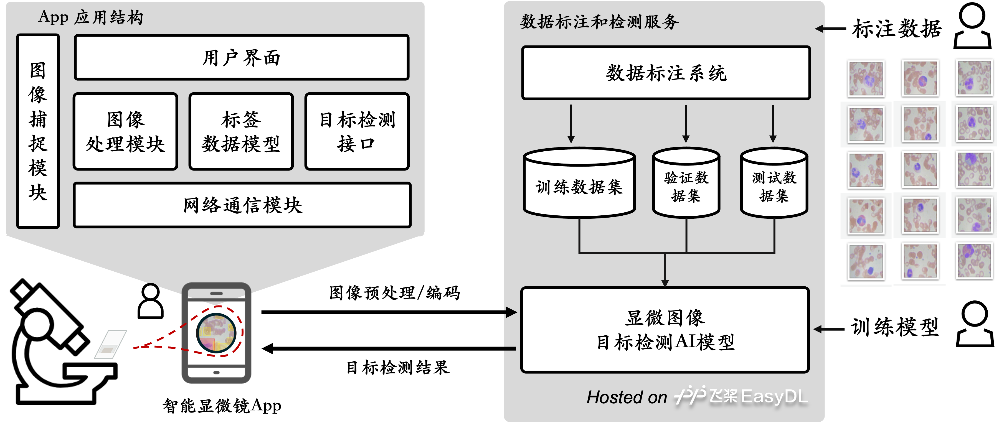

# 智能显微镜 SmartScope

**万岱绮(wdudu010@126.com)**

---

⚠️注意，请在Resource目录下创建config.json文件（格式如下），并分别替换其中的api_key和app_secret为你自己在Baidu EasyDL 上的 api_key 和 app_secret
```json
{
    "api_key" : "******",
    "app_secret" : "******"
}
```

## 显微影像识别基本流程

### 第一步、收集并标注数据
* 收集并制作样本玻片（至少100张以上，越多越好）
* 使用Microscope或者光学显微镜，通过手机拍摄样本显微图片
* 如果显微视野内目标数量较多，则需要先分割图片（1张分割为4张或8张）
* 将分割处理好的显微图片上传到数据标注平台
* 标注显微图片：用矩形框选出要识别的目标对象，并设置目标的标签（例如红细胞）
* 85%的标注数据用于测试集、10%用于验证集、5%用于测试集（验证集不是必须的）

### 第二步、训练并发布模型
* 使用测试数据集和验证数据集训练并调试模型
* 在EasyDL托管并发布训练好的模型，开放API接口

### 第三步、拍摄并识别显微影像
* 用户打开智能显微镜App，通过手机摄像头拍摄Microscope或者光学显微镜下的显微影像
* 用户也可以从手机相册中选择一张已经拍摄的显微图像
* 图像被编码后，通过API接口上传到EasyDL托管服务器，通过显微影像目标检测AI模型分析图像
* 服务器将识别结果返回给手机上的智能显微镜App
* 智能显微镜解析并在屏幕上显示显微图像和识别结果（包括检测到的目标数量、目标矩形框位置）

## 系统架构和流程



## App各功能模块说明

* **开发环境**：为了同时兼容Android和iOS两个手机平台，开发工具选择了Unity3D，版本号 v2019.4.29f1，程序开发语言为Microsoft C#
* **图像捕捉模块**：主要功能是连接手机摄像头获取实时显微影像，或者打开手机相册获取相册中拍摄好的显微图像，本模块使用了开源代码包NativeCamera和NativeGallery
* **图像处理模块**：包括两部分功能
  * 一是对捕捉到的显微图像进行压缩和编码（Base64）
  * 二是解析并在显微图像上绘制目标识别结果（转换标签位置坐标并在图像上使用不同颜色绘制目标矩形框图）
* **标签数据模型**：符合EasyDL API接口要求的标签数据模型，包括标签名称、颜色、标签坐标（在图像上的位置坐标）
* **目标检测接口**：和EasyDL服务器通信的API接口（使用Jason传输数据），功能包括发送图片编码数据到服务器，接收并解析服务器返回的检测结果数据
* **网络通信模块**：主要完成和EasyDL服务器的网络鉴权和数据传输功能
* **用户界面模块**：包括显示窗口（展示显微图像和标注数据）、图像缩放和移动功能，拍摄图片或打开相册选择图片等交互操作功能

## 数据标注和检测服务各模块说明
* **托管平台**：全部数据和AI模型均托管在百度飞桨EasyDL平台（https://ai.baidu.com/easydl/）
* **数据标注系统**：使用EasyData保管并在线标注样本数据
* **训练数据集**：用于训练AI模型的数据集，一般占全部数据的85%
* **验证数据集**：用户在AI模型训练过程中调优参数并验证结果
* **测试数据集**：用于检验训练好的AI模型性能（准确率和召回率）
* **显微图像目标检测AI模型**：训练好的目标检测AI模型（基于EasyDL物体检测模型创建），发布并部署在EasyDL，提供可通过网络访问的Web API接口
